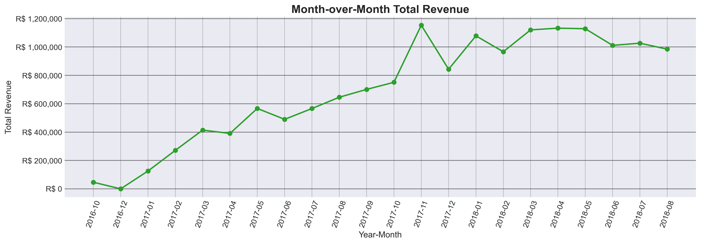
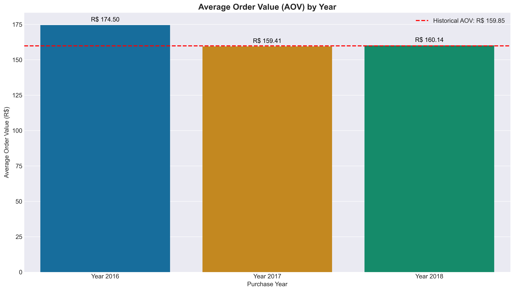
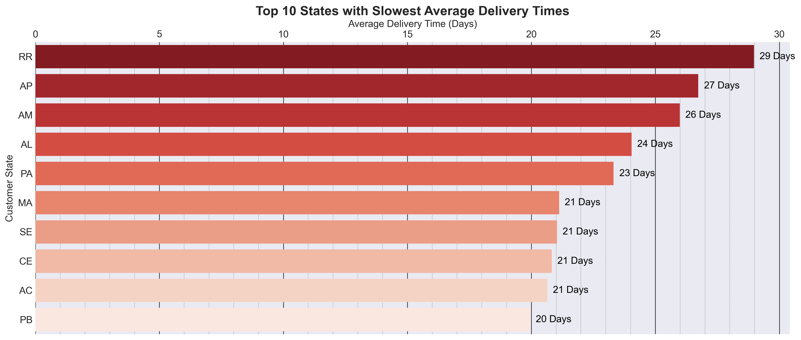
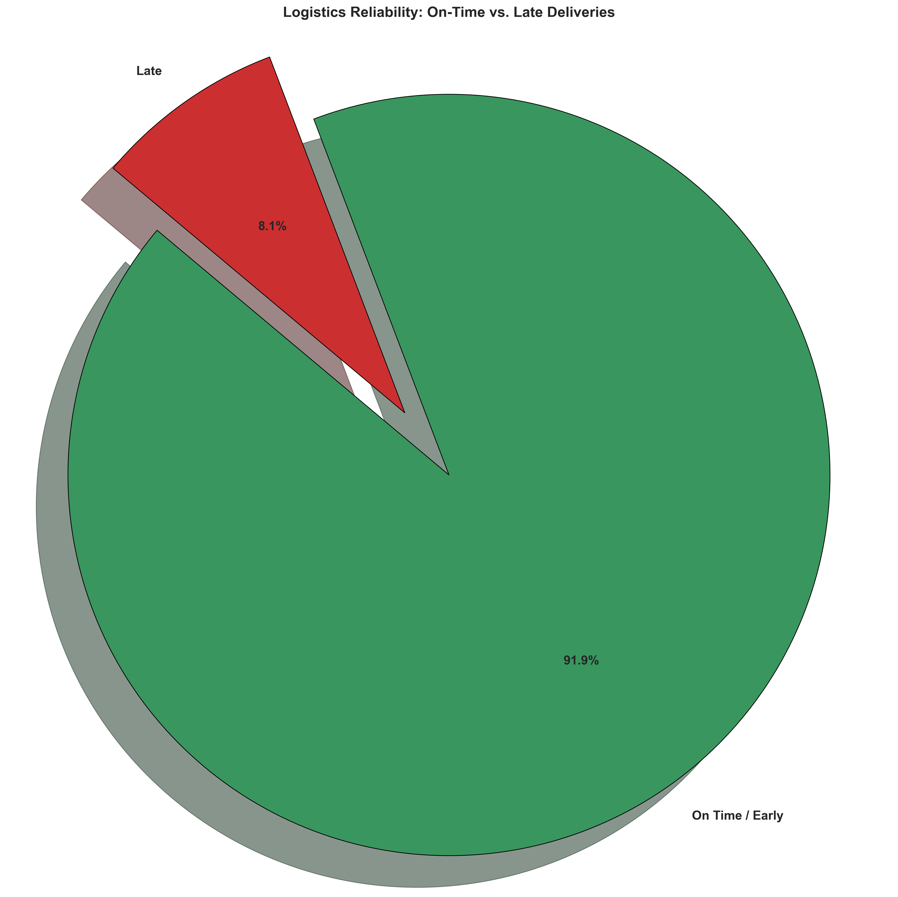
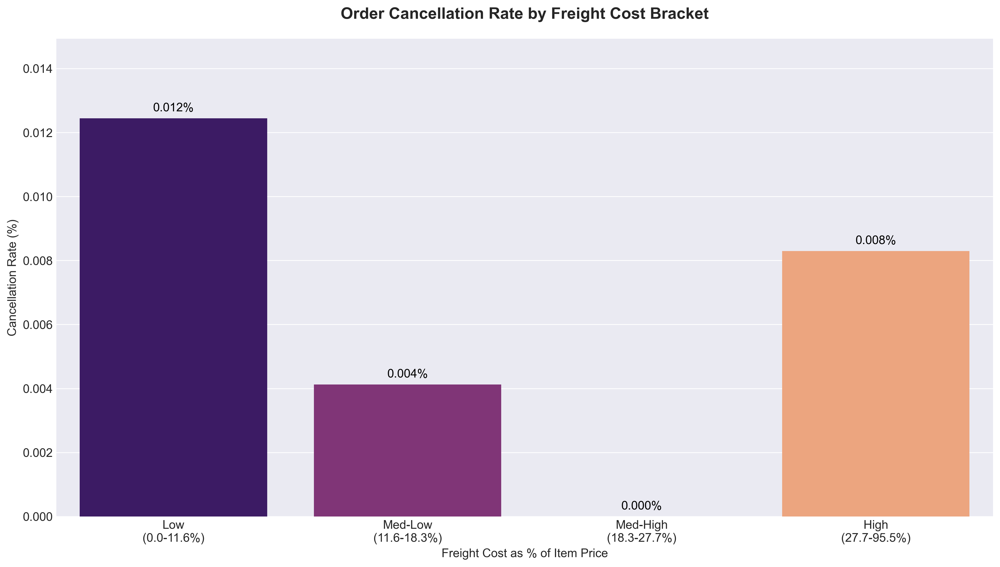
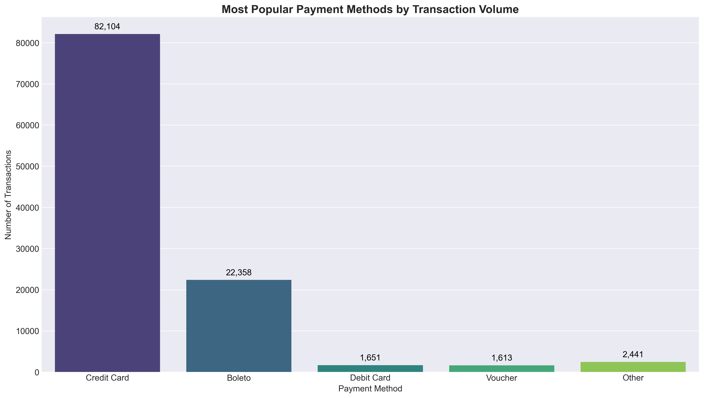
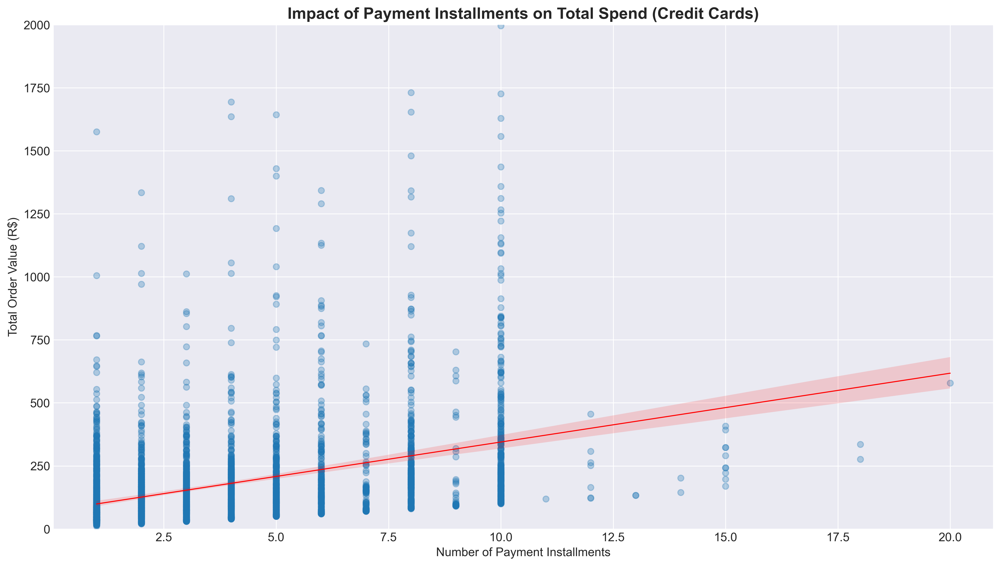
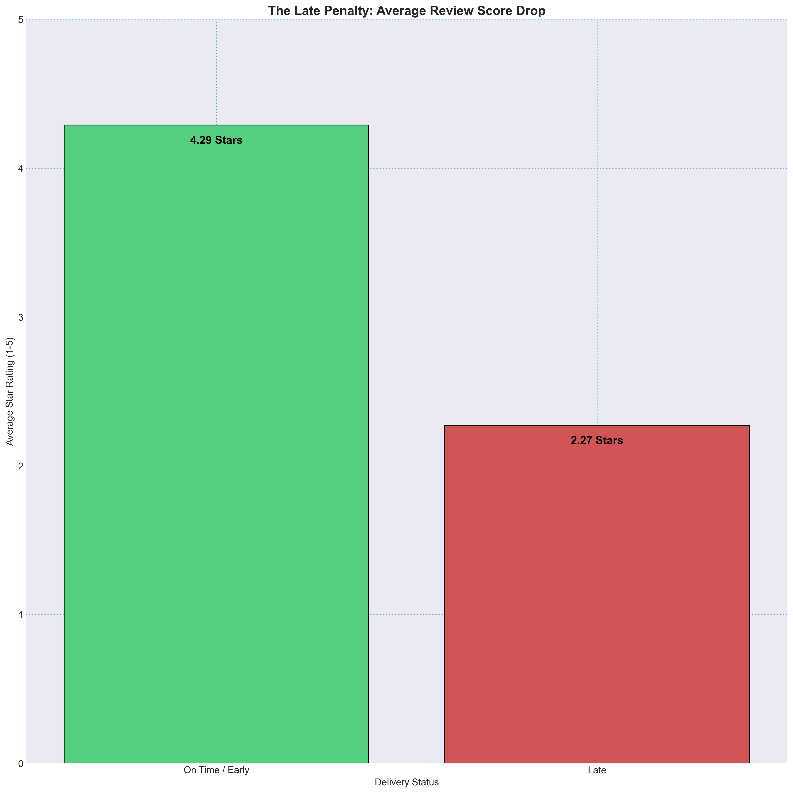
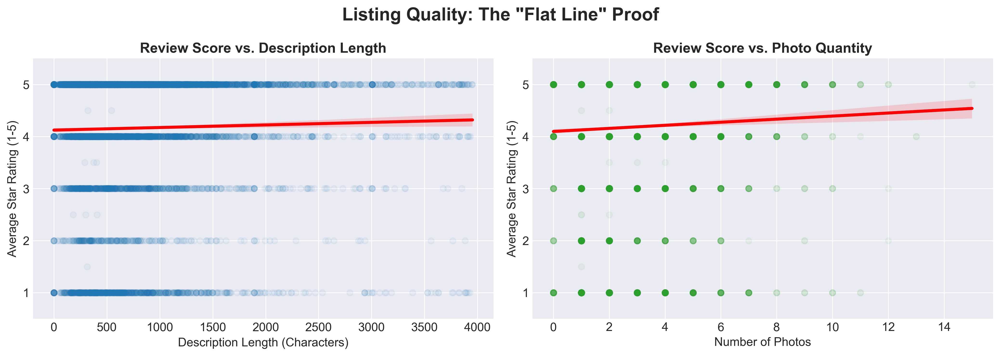

# Stage 5: Stakeholder Presentation & Visual Insights  
**Prepared By:** Animesh Sanghi  
**Objective:** To visually answer the core business questions and provide data-backed insights for decision-making.

---

 

## 📈 Topic 1: Sales & Revenue Trends

---

### Question 1.1: Month-over-Month Growth

---

* **Stakeholder Question:** What is the monthly revenue, and when do sales peak?
* **Analyst Question:** What is the total revenue generated month-over-month, and are there distinct seasonal spikes (e.g., holiday seasons)?

**Presentation Insight:** As you can see from the line chart, our revenue has steady baseline growth, but it spikes massively in November. This shows that our business is highly seasonal, with Black Friday driving a huge portion of our yearly sales. We need to ensure our inventory and servers are prepared for this surge every year.

### Question 1.2: Peak Traffic

---

* **Stakeholder Question:** Which days and hours get the most orders?
* **Analyst Question:** Which day of the week (purchase_day_of_week) and hour of the day (purchase_hour) see the highest volume of successful orders?

**Presentation Insight:** This heatmap tells us exactly when our customers are actively buying. The darkest spots (highest traffic) are concentrated on weekday afternoons, specifically Tuesdays around 16:00. **Actionable takeaway:** We should time our promotional emails and marketing ads to hit inboxes right before this peak window to maximize conversions.

### Question 1.3: Average Spending

---

* **Stakeholder Question:** What is the Average Order Value (AOV) per year?
* **Analyst Question:** What is the average amount a customer spends per transaction, and how does this change over the years?

**Presentation Insight:** Our Average Order Value (AOV) has remained very stable over the years, sitting around R$ 160. This is a sign of a healthy, predictable business. However, it also means we need to actively introduce strategies—like bundling products—if we want to force this number to go up.

## 🚚 Topic 2: Logistics & Delivery Performance

---

### Question 2.1: Delivery Time

---

* **Stakeholder Question:** What is the average delivery time, and which states have the slowest deliveries?
* **Analyst Question:** What is the average delivery_time_days across the platform, and which specific states (customer_state) suffer from the slowest average deliveries?

**Presentation Insight:** This chart highlights our biggest logistical bottleneck. Customers in the Northern and Northeastern states (like RR, AP, and AM) are waiting an average of 25 to 28 days for their packages. We must review our shipping partners in these regions to improve the customer experience.

### Question 2.2: Late Rates

---

* **Stakeholder Question:** How many orders are delivered late?
* **Analyst Question:** What percentage of total orders are flagged as is_late_delivery?

**Presentation Insight:** Overall, our delivery system works well, but around 6.7% to 8% of all deliveries arrive late. While this might seem like a small slice of the pie, these late deliveries are the primary cause of angry customers and 1-star reviews. 

### Question 2.3: Shipping Costs

---

* **Stakeholder Question:** Does high shipping cost cause order cancellations?
* **Analyst Question:** How does the freight_ratio (the cost of shipping relative to the item price) affect purchasing behavior? Do higher freight ratios lead to more canceled orders?

**Presentation Insight:** When the shipping cost is too high compared to the actual product price, customers get "checkout shock" and cancel their orders. For heavier items, we should consider subsidizing shipping costs (rolling part of the shipping fee into the item's base price) so the shipping fee looks less intimidating.

## 💳 Topic 3: Customer Buying Behavior

---

### Question 3.1: Payment Methods

---

* **Stakeholder Question:** What are the most used payment methods, and do credit cards lead to higher spending?
* **Analyst Question:** What is the distribution of payment_type? Do customers using credit cards have a significantly higher AOV than those using other methods?

**Presentation Insight:** Credit cards are clearly the most popular payment method, both in the number of transactions and the total amount spent. Ensuring our credit card processing is smooth and frictionless is critical to maintaining revenue.

### Question 3.2: Installments

---

* **Stakeholder Question:** Do payment installments increase order value?
* **Analyst Question:** Does the availability of payment_installments correlate with customers buying more expensive items (total_item_value)?

**Presentation Insight:** Yes, they do. The scatter plot shows a moderate positive correlation (0.32). When we let customers split their payments, they feel more comfortable buying expensive items. We should prominently display "0% EMI" options on all high-ticket products.

### Question 3.3: Top Spenders

---

* **Stakeholder Question:** Which 10 cities have the highest-spending customers?
* **Analyst Question:** Which top 10 cities have the highest concentration of customers in the top 5% based on total payment value?

**Presentation Insight:** Our VIP customers (the top 5% of spenders) are highly concentrated in major hubs like São Paulo and Rio de Janeiro. Since we know exactly where our best customers live, we can launch geo-targeted VIP loyalty programs specifically in these cities to encourage repeat purchases.

## 🛍️ Topic 4: Product Catalog Insights

---

### Question 4.1: Top Products

---

* **Stakeholder Question:** Which product categories generate the most revenue and most sales?
* **Analyst Question:** Which product_category_name drives the highest total revenue, and which drives the highest volume of individual items sold?

**Presentation Insight:** This combo chart separates our "cash cows" from our "high velocity" items. Categories like "Health & Beauty" and "Bed, Table & Bath" are absolute winners—they drive massive volume and top-tier revenue. We must ensure these specific categories never go out of stock.

### Question 4.2: Late Penalty

---

* **Stakeholder Question:** How much do late deliveries lower customer review scores?
* **Analyst Question:** Is there a direct, quantifiable drop in the average review_score when an order's delivery_delay_days is greater than 0?

**Presentation Insight:** This is one of the most important charts in the project. When a package arrives on time, our average rating is a healthy 4.29 stars. When it is late, the score plummets to 2.27 stars. Logistics directly dictate brand reputation. 

### Question 4.3: Listing Quality

---

* **Stakeholder Question:** Do more photos and longer descriptions improve product review scores?
* **Analyst Question:** Do products with longer descriptions (product_description_lenght) or more photos (product_photos_qty) statistically receive higher review scores or lower return rates?

**Presentation Insight:** The data busts a common myth: the correlation between long descriptions/lots of photos and 5-star reviews is practically zero. We should stop wasting staff time writing massive descriptions, and instead use that time to improve shipping speeds, which actually drive good reviews.

## 🤖 Topic 5: Predictive Analytics

---

### Question 5.1: Predicting Satisfaction

---

* **Stakeholder Question:** Can a Linear Regression model predict how much review scores drop per day of delay?
* **Analyst Question:** Can we mathematically predict the exact drop in customer satisfaction for every additional day a delivery is delayed past its estimated arrival date using a Linear Regression model?

**Presentation Insight:** Using Machine Learning, we built a regression line to predict exactly how punishing delays are. For every single extra day a package is late past its estimate, the product's rating mathematically drops by ~0.05 stars. **Actionable takeaway:** We should automatically add 3 "padding" days to estimated delivery dates in slow regions. Delivering "early" on a long promise protects our star rating.

 
 

## 👨‍💻 Author  

---

**[Animesh Sanghi](Animesh_Resume.pdf)** | *Data Analyst | MBA '28 (Analytics & Data Science) MUJ*  
9406570600 | animeshsanghi.da@gmail.com | [LinkedIn Profile](https://www.linkedin.com/in/animeshsanghi-da/) | [GitHub Profile](https://github.com/animeshsanghi-da)