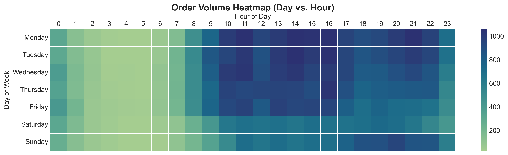
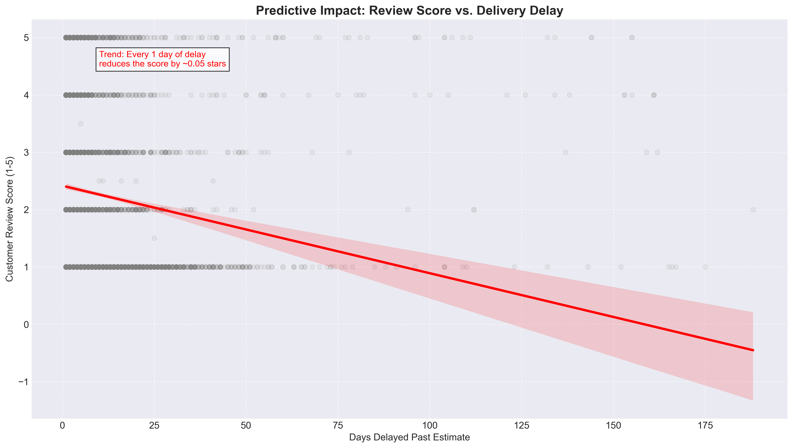
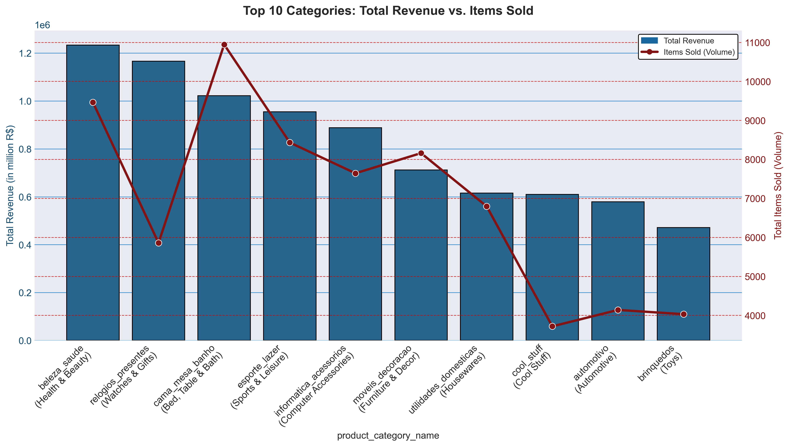
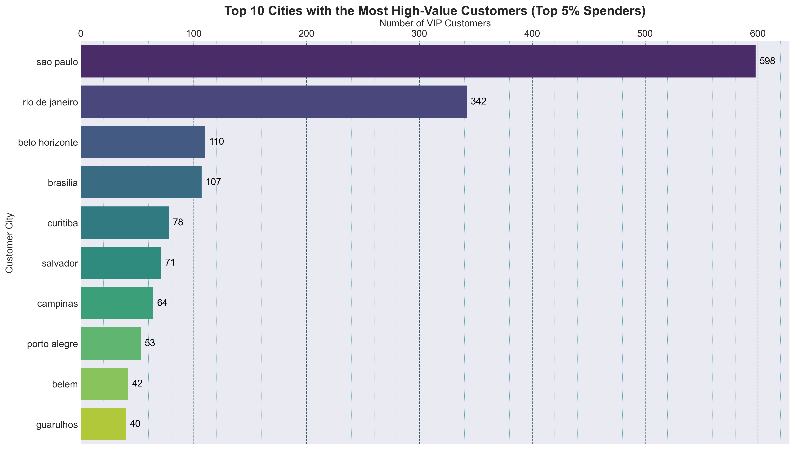

# Stage 6: Strategic Action Plan & Executive Presentation

---

**Prepared By:** Animesh Sanghi  
**Objective:** To translate our data insights into direct, revenue-generating business actions.

 

## 📈 Strategic Action 1: Drive Revenue Through Strategic Timing & Payments

---

**The Insight:** Our average order value (AOV) is steady, but our store gets the most traffic and sales on weekday afternoons (specifically Tuesdays around 16:00). Also, the data shows a clear positive link (0.32 correlation) between offering payment installments and customers placing larger, more expensive orders.

**The Action:** * **Targeted Ads:** Move the biggest part of the digital marketing budget to run during weekday afternoons when people are already buying.
* **Push Installments:** Highlight "0% EMI" and credit card installment options clearly on the checkout page to encourage customers to spend more.

## 🚚 Strategic Action 2: Fix the "Late Penalty" to Protect Customer Trust

---

**The Insight:** Across the whole system, 6.77% of deliveries are late. When a package arrives late, the average customer review drops terribly from 4.29 stars down to 2.27 stars. Using a Machine Learning model (Linear Regression), I found that for every single day a package is delayed, the product's rating mathematically drops by ~0.05 stars.

**The Action:** * **Investigate Shippers:** Start an immediate review of our shipping partners in the Northern and Northeastern states (like RR, AP, and AM), because deliveries there are taking up to 28 days.
* **Adjust Estimates:** Automatically add 3 extra days to the "Estimated Delivery Date" shown to customers in these slow regions. The data proves that delivering early on a longer promise keeps customers happier than missing a short deadline.

## 🛍️ Strategic Action 3: Optimize the Catalog and Ignore Myths

---

**The Insight:** "Health & Beauty" and "Bed & Bath" are our most important product categories—they bring in the most money and the highest number of sales. On the other hand, the data proves that writing extremely long product descriptions or adding tons of photos does not actually improve customer reviews (the correlation is near zero). 

**The Action:** Stop wasting staff time writing massive product descriptions. Instead, use that time to make sure our top-selling "Health & Beauty" products are always in stock and ship quickly, because fast shipping is what actually gets 5-star reviews.

## 💎 Strategic Action 4: Launch a Geo-Targeted VIP Program

---

**The Insight:** Our top 5% of highest-spending customers do not live everywhere; they are heavily grouped in major cities like Rio de Janeiro, São Paulo, and Vitória.

**The Action:** Create an exclusive "E-commerce Plus" loyalty program just for customers living in these top 10 cities. Offer them fast, discounted shipping to make sure they keep coming back to us instead of competitors.

## 🚨 Strategic Action 5: Fix the "One-Time Buyer" Problem (Bonus Insight)

---

**The Insight:** Even though we are good at getting new customers, over 90% of our users only ever buy from us once. It costs a lot of money to run marketing ads for new customers, and we are losing profits because they do not return to buy a second time.

**The Action:** Change our marketing focus from just "getting new users" to "keeping existing users." Create an automated email system that sends a strong discount code to a customer right after their first purchase to encourage them to come back.

 

## 🤖 Strategic Action 6: Use AI to Improve Customer Support

---

**The Insight:** When a package is late, customers get angry and leave 1-star reviews. This gets worse because our human customer service team cannot reply to everyone fast enough during busy times.

**The Action:** Set up an AI-powered chatbot on the website to handle basic, 24/7 customer support and track orders. This will save money on hiring more support staff and will solve simple customer problems quickly before they get angry and leave a bad review.

 
 

## 🏁 Conclusion

---
By using these data-backed strategies, the business can stop just looking at numbers and start actively growing. Fixing shipping times in the North protects our brand reputation, and focusing our budget on high-selling items and VIP cities will increase our profits. This project shows exactly how deep data analysis leads to real-world business success.

 
 

## 👨‍💻 Author  

---

**[Animesh Sanghi](Animesh_Resume.pdf)** | *Data Analyst | MBA '28 (Analytics & Data Science) MUJ*  
9406570600 | animeshsanghi.da@gmail.com | [LinkedIn Profile](https://www.linkedin.com/in/animeshsanghi-da/) | [GitHub Profile](https://github.com/animeshsanghi-da)