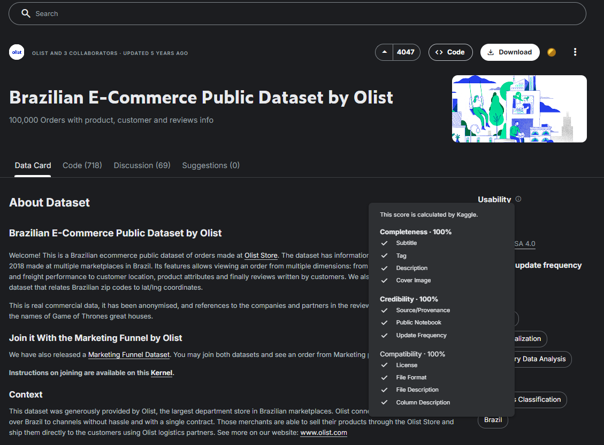
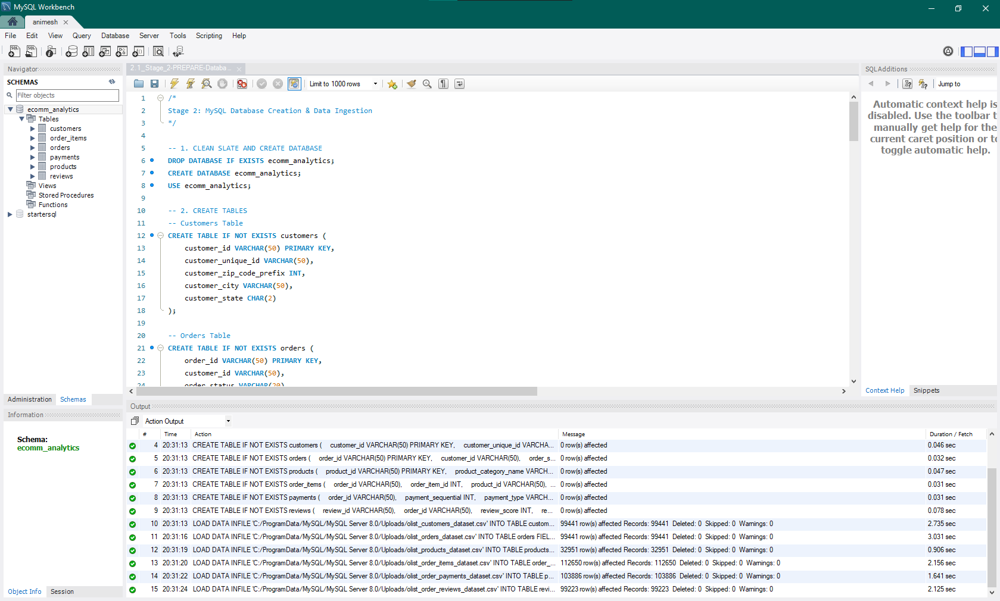
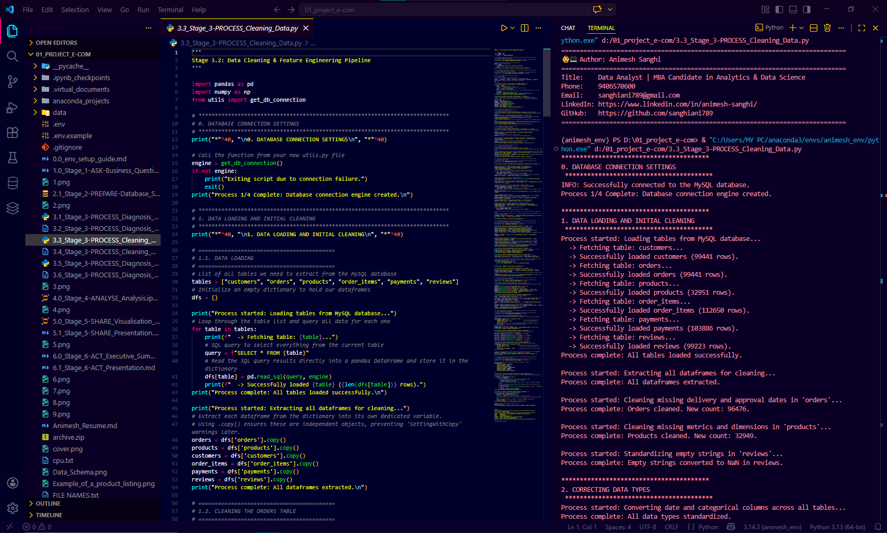
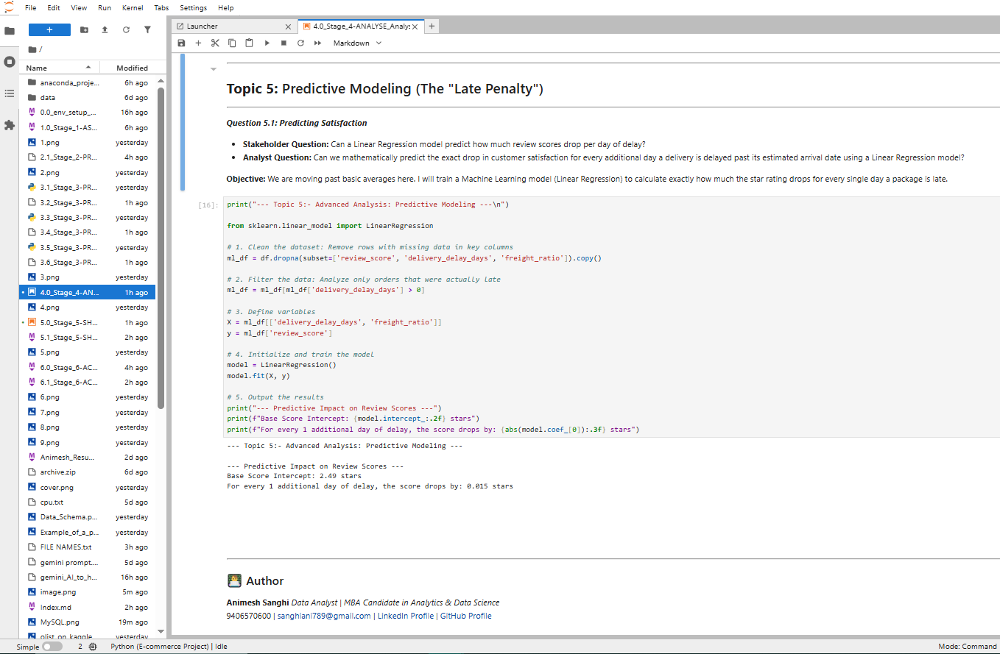
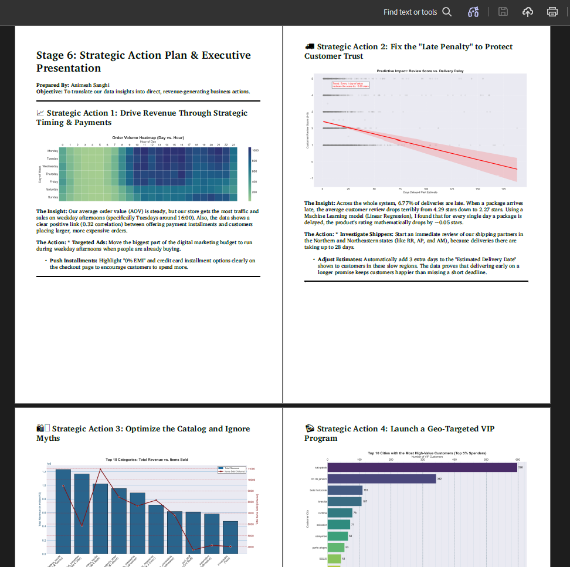

# Olist E-Commerce Data Analysis

[](https://www.kaggle.com/datasets/olistbr/brazilian-ecommerce) [](https://www.python.org/) [](https://www.mysql.com/) [](https://pandas.pydata.org/) [](https://numpy.org/) [](https://scikit-learn.org/) [](https://www.sqlalchemy.org/) [](https://dev.mysql.com/doc/connector-python/en/) [](https://github.com/theskumar/python-dotenv) [](https://matplotlib.org/) [](https://seaborn.pydata.org/) [](https://jupyter.org/) [](https://code.visualstudio.com/) [](https://www.anaconda.com/)

---

Olist E-Commerce Data Analysis is an end-to-end data analytics pipeline and predictive modeling project based on the Brazilian E-commerce public dataset provided by Olist on Kaggle. The project processes over 100k real commercial orders across 6 relational database tables to uncover critical business drivers behind revenue growth, delivery bottlenecks, peak sales hours, and customer retention.

Following the industry-standard 6-stage data analytics framework (**Ask, Prepare, Process, Analyse, Share, and Act**), this project integrates MySQL database storage with automated Python ETL scripts, exploratory data analysis in Jupyter Lab, and a predictive Linear Regression model to calculate the mathematical penalty of shipping delays on customer review ratings.


## Project Features
* Implementation of the complete 6-Stage Data Analytics Framework (Ask, Prepare, Process, Analyse, Share, Act)
* Relational MySQL database schema setup and raw CSV data ingestion
* Secure database authentication module (`utils.py`) with environment variable fallback and CLI password masking
* Automated Python ETL pipeline for data cleaning, data type conversion (`float32` memory optimization), and table merging
* Exploratory Data Analysis (EDA) on payment installment impact, cart values, and traffic heatmaps
* Predictive Linear Regression model quantifying the "Late Penalty" on customer review ratings
* High-impact business visualizations using Matplotlib and Seaborn
* Executive summary report and stakeholder slide decks in Markdown and PDF formats

## Transaction & Master Types
The project processes the following e-commerce relational dataset tables:

* Orders (`olist_orders_dataset.csv`): Core transaction details, order status, and tracking timestamps
* Order Items (`olist_order_items_dataset.csv`): Itemized breakdown, pricing, seller IDs, and freight values
* Products (`olist_products_dataset.csv`): Catalog specifications, category translations, item dimensions, and weight
* Customers (`olist_customers_dataset.csv`): Buyer unique IDs, zip codes, cities, and states
* Reviews (`olist_order_reviews_dataset.csv`): Customer satisfaction scores (1 to 5 stars) and review comments
* Payments (`olist_order_payments_dataset.csv`): Payment methods, installment breakdowns, and transaction values

## Technologies Used
* Python 3.10+
* MySQL / MySQL Workbench
* Pandas
* NumPy
* Scikit-Learn
* SQLAlchemy & MySQL Connector
* python-dotenv
* Matplotlib & Seaborn
* Jupyter Lab / Jupyter Notebook
* VS Code & Anaconda

## Project Structure
```text
olist-ecommerce-data-analysis/
├── data/
│   ├── olist_customers_dataset.csv
│   ├── olist_geolocation_dataset.csv
│   ├── olist_order_items_dataset.csv
│   ├── olist_order_payments_dataset.csv
│   ├── olist_order_reviews_dataset.csv
│   ├── olist_orders_dataset.csv
│   ├── olist_products_dataset.csv
│   └── olist_sellers_dataset.csv
├── 0.1_env_setup_guide.md
├── 1.0_Stage_1-ASK-Business_Questions.md
├── 2.1_Stage_2-PREPARE-Database_Setup.sql
├── 3.1_Stage_3-PROCESS_Diagnosis_Raw.py
├── 3.2_Stage_3-PROCESS_Diagnosis_Raw_Output.txt
├── 3.3_Stage_3-PROCESS_Cleaning_Data.py
├── 3.4_Stage_3-PROCESS_Cleaning_Data_Output.txt
├── 3.5_Stage_3-PROCESS_Diagnosis_Cleaned.py
├── 3.6_Stage_3-PROCESS_Diagnosis_Cleaned_output.txt
├── 4.0_Stage_4-ANALYSE_Analysis.ipynb
├── 5.0_Stage_5-SHARE_Visualisation_Report.ipynb
├── 5.1_Stage_5-SHARE_Presentation.md
├── 6.0_Stage_6-ACT_Executive_Summary_Report.md
├── 6.1_Stage_6-ACT_Presentation.md
├── utils.py
├── requirements.txt
├── .env.example
├── .gitignore
├── Olist_Project_Report.pdf
├── Animesh_Resume.pdf
└── README.md
```

## File Information
| File / Folder                                  | Purpose                                                                                                          |
| :--------------------------------------------- | :--------------------------------------------------------------------------------------------------------------- |
| `0.1_env_setup_guide.md`                       | Step-by-step guide for Python environment configuration and Anaconda dependency setup                            |
| `1.0_Stage_1-ASK-Business_Questions.md`        | Outlines business objectives, analytical questions, and stakeholder requirements                                 |
| `2.1_Stage_2-PREPARE-Database_Setup.sql`       | SQL script creating the `ecomm_analytics` schema and importing raw CSV datasets into MySQL                       |
| `3.1_Stage_3-PROCESS_Diagnosis_Raw.py`         | Python script performing initial raw data diagnostics and null value analysis                                    |
| `3.3_Stage_3-PROCESS_Cleaning_Data.py`         | Automated ETL pipeline handling data type conversions (`float32`), feature engineering, and master table merging |
| `3.5_Stage_3-PROCESS_Diagnosis_Cleaned.py`     | Post-cleaning verification script validating data integrity and merged master views                              |
| `4.0_Stage_4-ANALYSE_Analysis.ipynb`           | Jupyter Notebook containing Exploratory Data Analysis (EDA) and Linear Regression modeling                       |
| `5.0_Stage_5-SHARE_Visualisation_Report.ipynb` | Technical notebook generating custom charts, traffic heatmaps, and exporting high-res PNG plots                  |
| `5.1_Stage_5-SHARE_Presentation.md`            | Markdown slide deck presenting key visual insights for stakeholder review                                        |
| `6.0_Stage_6-ACT_Executive_Summary_Report.md`  | Comprehensive executive report outlining actionable growth and operational strategies                            |
| `6.1_Stage_6-ACT_Presentation.md`              | Stakeholder presentation linking visual findings directly to business recommendations                            |
| `utils.py`                                     | Secure database connection module supporting `.env` secrets and CLI password fallback                            |
| `Olist_Project_Report.pdf`                     | Master project compilation document consolidating all code, outputs, and analytical stages                       |
| `requirements.txt`                             | Defines exact Python library versions for environment recreation                                                 |

## Installation
1. Clone the Repository
```bash
git clone [https://github.com/animeshsanghi-da/olist-ecommerce-data-analysis.git](https://github.com/animeshsanghi-da/olist-ecommerce-data-analysis.git)
cd olist-ecommerce-data-analysis
```

2. Download and Place Dataset
Download the raw dataset from Kaggle and extract all CSV files into a folder named `data/` within the project root directory.



3. Setup the Anaconda Virtual Environment
```bash
conda create --name animesh_env --file requirements.txt
conda activate animesh_env
python -m ipykernel install --user --name=animesh_env --display-name="Python (E-commerce Project)"
```

4. Configure Database Credentials
Copy the sample environment file and add your local MySQL credentials:
```bash
cp .env.example .env
```
Update `.env` with your password:
```env
MYSQL_PASSWORD=your_mysql_password_here
```

## How to Run
1. Initialize the Database
Open MySQL Workbench (or your preferred SQL client) and execute:
```sql
2.1_Stage_2-PREPARE-Database_Setup.sql
```
This builds the `ecomm_analytics` database and imports the raw CSV files.



2. Run the Data Cleaning Pipeline
Execute the Python diagnostic and cleaning scripts in your activated terminal:
```bash
python 3.1_Stage_3-PROCESS_Diagnosis_Raw.py
python 3.3_Stage_3-PROCESS_Cleaning_Data.py
python 3.5_Stage_3-PROCESS_Diagnosis_Cleaned.py
```




3. Run Exploratory Analysis & Visualizations
Launch Jupyter Lab, select the `Python (E-commerce Project)` kernel, and execute:
* `4.0_Stage_4-ANALYSE_Analysis.ipynb` - For EDA and Linear Regression modeling
* `5.0_Stage_5-SHARE_Visualisation_Report.ipynb` - To generate and save chart figures



4. Review Executive Presentations & Strategy
Open the final presentation decks and executive report:
* `5.1_Stage_5-SHARE_Presentation.md`
* `6.0_Stage_6-ACT_Executive_Summary_Report.md`
* `6.1_Stage_6-ACT_Presentation.md`




## System Workflow
```text
Download Raw Kaggle CSVs into /data
           ↓
Execute MySQL Setup (Schema Creation & Data Ingestion)
           ↓
Run Python Diagnostics on Raw Data
           ↓
Automated ETL & Data Cleaning Pipeline (utils.py & 3.3_Stage_3)
           ↓
Cleaned Master Analytical View Exported to MySQL
           ↓
Exploratory Data Analysis & Linear Regression Modeling (4.0 Jupyter Notebook)
           ↓
Visualization Generation & PNG Exports (5.0 Jupyter Notebook)
           ↓
Executive Summary & Stakeholder Presentations (Stage 6 ACT)
```

## Financial Metrics Analyzed
The project extracts and evaluates key commercial and operational KPIs:

* Total Sales Revenue & AOV: Top-line revenue breakdown, category performance, and Average Order Value metrics
* Late Delivery Penalty: Linear Regression coefficient proving that every 1 day of shipping delay reduces customer review ratings by ~0.05 stars (causing ratings to plunge from ~4.2 to 2.5 stars on late deliveries)
* Peak Shopping Heatmap: Peak traffic identification pinpointing Mondays and Tuesdays between 1:00 PM and 4:00 PM as prime purchasing windows
* Installment Value Correlation: Statistical correlation (0.32) between payment installment counts and higher order checkout values
* Shipping Fee Danger Zone: Cancellation threshold analysis proving order cancellation risks spike when freight costs exceed 20% to 33% of order value
* Customer Retention Rate: Evaluation showing >90% single-time purchase rate, driving recommendations for automated post-purchase retention funnels

## Important Note
* Database connection uses secure masked password handling via `utils.py`, allowing automatic `.env` reading or fallback manual terminal entry (up to 3 attempts).
* Column names like `product_name_lenght` and `product_description_lenght` keep their original database spelling from the source dataset to preserve pipeline stability.
* Numerical columns are cast to `float32` during processing to reduce memory usage during multi-table joins.

## Useful Links
* [Python](https://www.python.org/)
* [Pandas](https://pandas.pydata.org/)
* [MySQL](https://www.mysql.com/)
* [Scikit-learn](https://scikit-learn.org/)
* [Seaborn](https://seaborn.pydata.org/)
* [Olist Brazilian E-Commerce Dataset (Kaggle)](https://www.kaggle.com/datasets/olistbr/brazilian-ecommerce)
* [Olist Official Website](https://olist.com/)

## Created By
Name: Animesh Sanghi  
Profession: Data Analyst | MBA '28 (Analytics & Data Science) MUJ  
LinkedIn: linkedin.com/in/animeshsanghi-da  
GitHub: github.com/animeshsanghi-da  
Email: animeshsanghi.da@gmail.com

## Project Status
```text
Olist E-Commerce Data Analytics & Predictive Modeling Project
```

## License
This project is open-source and free to use.
